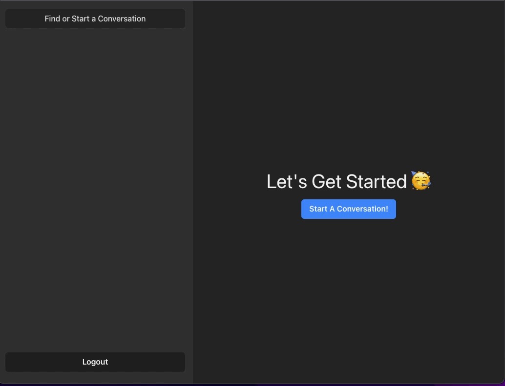
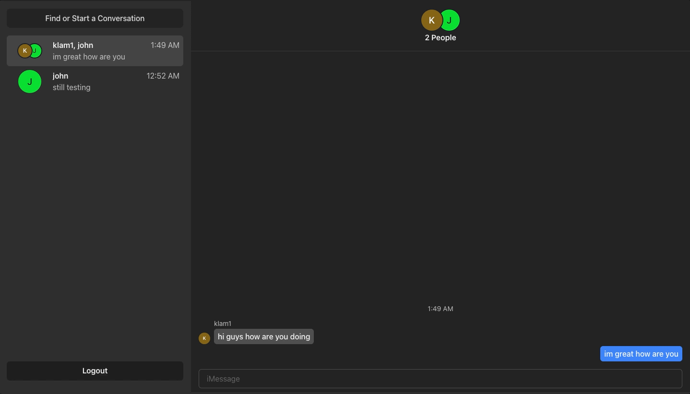
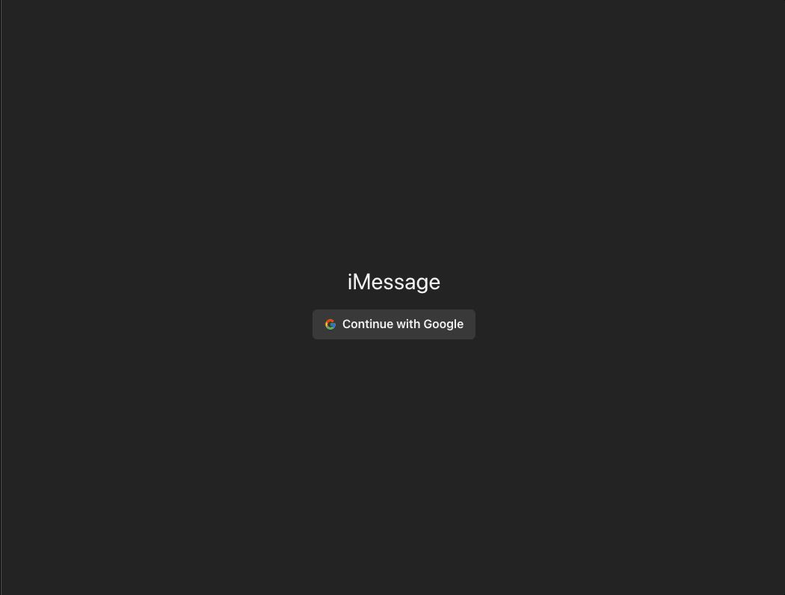
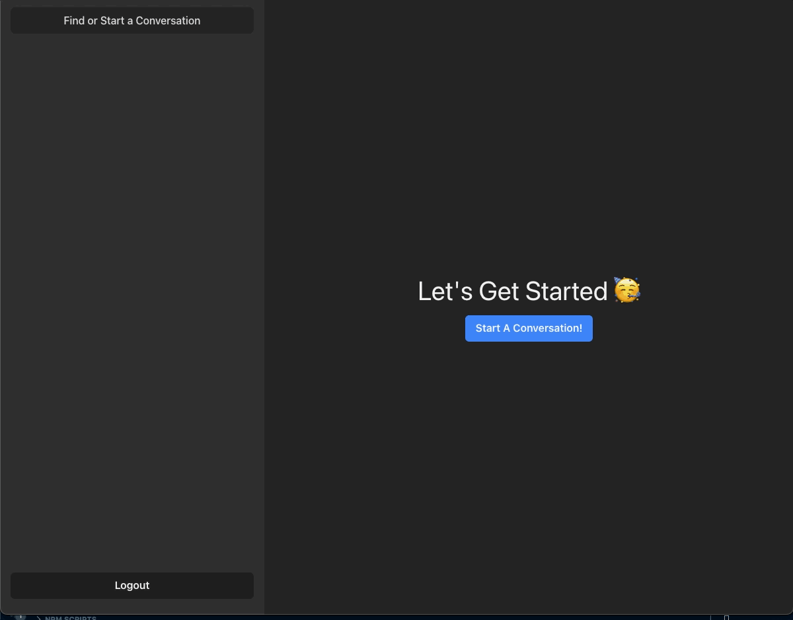
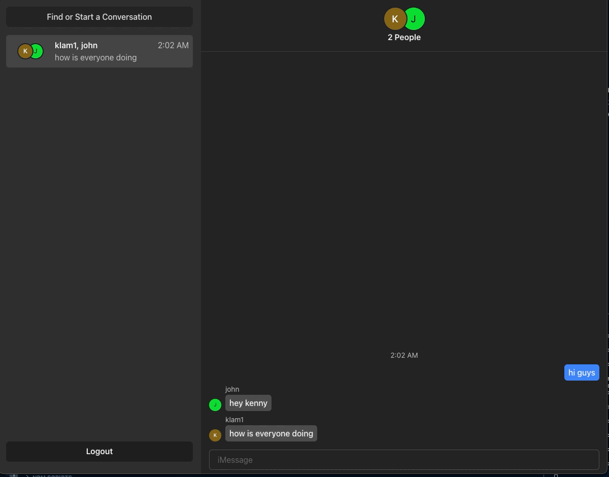
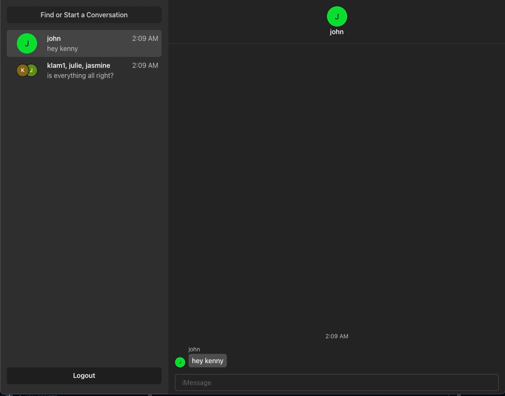
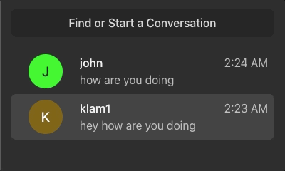

<p align="center">
    
</p>

## Overview

This is a responsive iMessage clone. The application supports real-time messaging in individual
and group settings, real-time notifications, allows users to remove and/or add participants into conversations,
and delete and/or leave conversations.

## Technology

- 
- 
- 
- 
- 
- 

## Features

- Responsive Design
<p align="center">
    
</p>

- Authenication with NextAuth
<p align="center">
    
</p>

- Group Conversations
<p align="center">
    
</p>

- Edit Group Conversation Participants
<p align="center">
    
</p>

- Leave Group Conversation and Delete Conversation
<p align="center">
    
</p>

- Real-time Notifications
<p align="center">
    
</p>

## Getting Started

### Prerequisites

- yarn/npm
- Sign up for MongoDB Atlas
  - Create a shared database

### Backend Installation

```sh
# Clone the repo
git clone https://github.com/klam2k20/iMessage-Clone.git

# Create config.env
cd iMessage-Clone/server
PORT=4000
MONG0DB_URI=<MONGODBURI>
CLIENT_ORIGN=http://localhost:3000

# Install dependencies
npm install

# Start the server
npm run dev
```

### Frontend Installation

```sh
cd ../frontend

# Install dependencies
npm install

# Start the application
npm run dev
```
